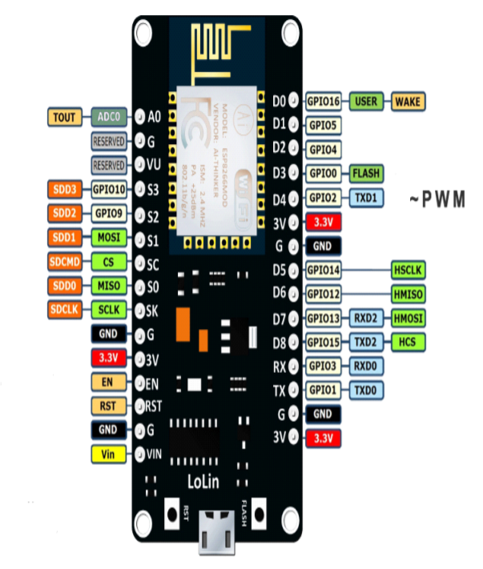
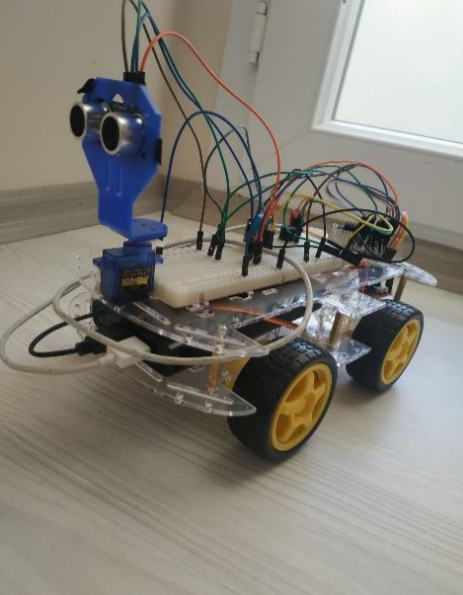
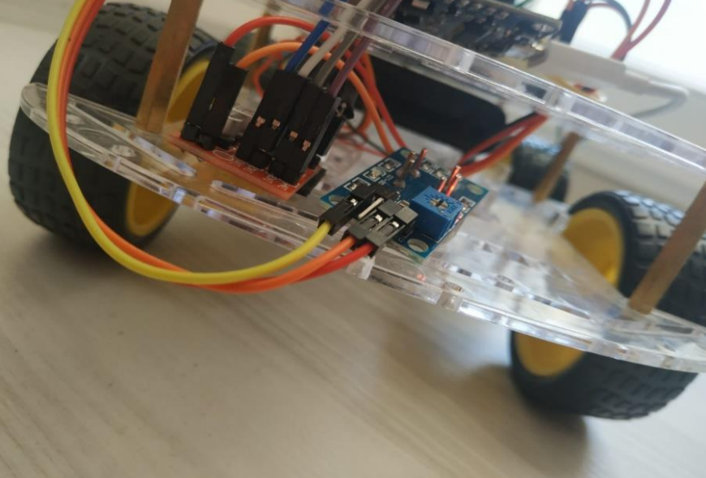

# indoor-mapping with arduino car

## **ABSTRACT**
In this project, we made an IoT system that does indoor mapping of a closed environment (mostly rooms) and measurements of elements such as air-quality, humidity and temperature. 
We used machine learning to make predictions of numbers of people can inhabit in these environments. For sketching maps, we used turtle module in python and to handle measured 
data, we used Firebase servers. A Nodemcu board is used to connect to Wi-Fi. Following images are for the nodemcu board and the arduino car.

  

## **PROBLEM DEFINITION**
Collecting data from an environment remotely can be quite important in some applications. The air might be poisonous or the temperature might be at a risky level and we would also want to know how much space there is in an unknown environment. So, this project is for exploring purposes and make predictions on how many people can live in a certain area.
Measurements are recorded to the server and can be easily retrieved from the server to a computer that has the python code running. With this code, we are able to sketch the obtained distance measurements according to the car position and we can also monitor other types of measurements on the screen.
